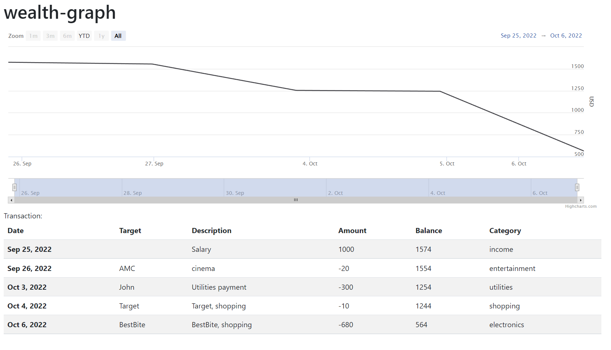

# wealth-graph

**NOTE**: this project is work in progress. It does not accept any bug reports or feature requests.

**wealth-graph** is a desktop application for visualizing your net-wealth and spending/incomes.
You can feed your bank, credit-card, investment history to the app and it will visualize it for you.
In short: app should replace you spreadsheet, that you use for tracking your money.

**NOTE**: this app is best-effort. It does not want to be perfect on economic terms

Screenshot from the app:

## Why is there an N+1 financial app after [Firefly III](https://www.firefly-iii.org/), [Beancount](https://beancount.github.io/fava/) and [many more](https://github.com/awesome-selfhosted/awesome-selfhosted/blob/master/README.md#money-budgeting--management)?
I'm tracking my wealth and spending in a spreadsheet that is toilsome.
I needed a tool, where I can import the history of all my bank accounts, broker accounts, credit cards and fintech accounts
and the app tells me how much is my net wealth  using up-to-date stock prices and currency exchange rate. 
On the top of that it offers minimal analytical options: like categorizing spendings, how far am I from [FIRE](https://www.investopedia.com/terms/f/financial-independence-retire-early-fire.asp), etc. 
Furthermore, for security reasons, I needed a tool that runs locally as a desktop app. 

## Running

1. Clone the project
2. `npm install` (you need node 14 or higher)
3. `npm start`

## TODOs

* nicer UI
* creat configuration
* data parser (for loading bank histories)
  * creating simple so people can implement their own parsers
  * supporting some accounts by default:
    * UBS
    * Interactive brokers
    * Revolut
    * etc.
* support multiple currencies
* download actual currency prices to visualize net-wealth more precisely
* add automatic cross account transfer detection (i.e: if you send money between your accounts, that is not an expanse or an income)
* create release workflow

### Used technologies:
 * electron (for desktop app)
 * Angular
 * Bootstrap
 * Highcharts

App bootstrap: https://github.com/maximegris/angular-electron
